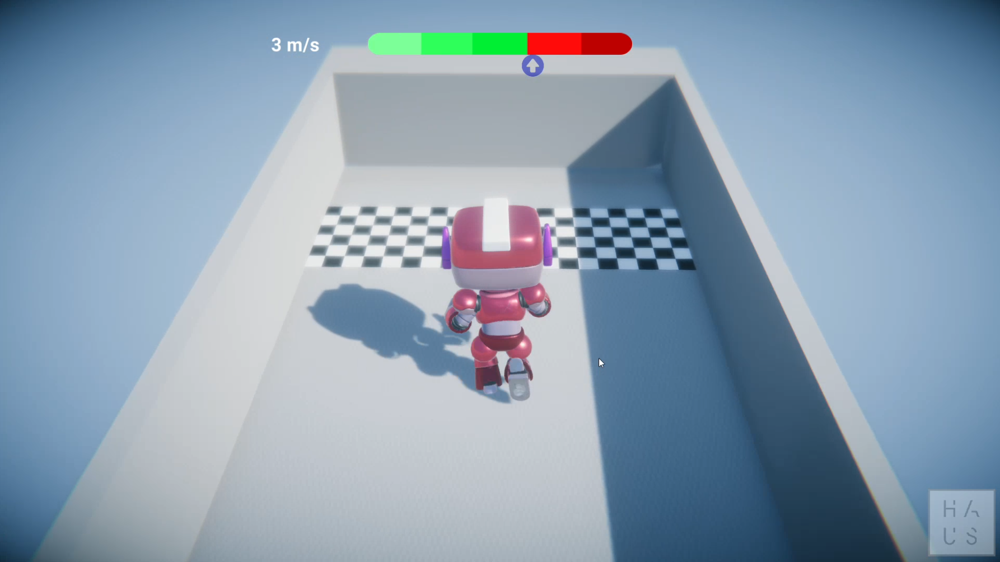

<h1 align="center">
    Plugin - Medida de Velocidade Média com Replay
</h1>

  
  
  
  

  <a href="#descrição">Descrição</a>&nbsp;&nbsp;&nbsp;|&nbsp;&nbsp;&nbsp;
  <a href="#instruções">Download</a>&nbsp;&nbsp;&nbsp;|&nbsp;&nbsp;&nbsp;
  <a href="#demonstração">Demonstração</a>&nbsp;&nbsp;&nbsp;|&nbsp;&nbsp;&nbsp;
  <a href="#licença">Licença</a>

 

## Descrição

Plugin que permite a medição da velocidade média de um GameObject, além de também possibilitar a visualização do replay do movimento exato (posição, rotação e velocidade) desse GameObject.

## Download

Há duas formas de fazer o download do plugin:

1. Através de um arquivo .unitypackage: [clique aqui para fazer download com essa opção](https://trello-attachments.s3.amazonaws.com/5d7103284f29811d5b2724b1/5fae81b4563cb4473e9575c3/93b2408a7cfea7a0f48d4715b9cf974c/EH_-_Plugin_de_Medida_de_Velocidade_com_Replay.unitypackage). Após o download, importe-o para o seu projeto Unity.
2. Realizando o download desse repositório e importando, de forma completa, a pasta *EH - Plugin de Medida de Velocidade com Replay* para o seu projeto Unity.

Os downloads acima (125MB) possuem os scripts do plugin, localizados na pasta *Main Scripts* e também possuem uma cena completa de exemplo (a mesma da imagem e vídeo) para ajudar na aplicação do plugin no seu próprio projeto. Caso deseje fazer o download apenas dos scripts principais do plugin (pasta *Main Scripts*), cujo arquivo tem o tamanho de apenas 4KB, [clique aqui](https://github.com/estudiohaus/Unity-Medida-Velocidade-Com-Replay/blob/main/EH%20-%20Plugin%20de%20Medida%20de%20Velocidade%20com%20Replay%20-%20Lite.zip).

## Demonstração:

## Licença

Esse projeto é licenciado pela MIT License. Veja a página da [licença](https://opensource.org/licenses/MIT) para detalhes.
